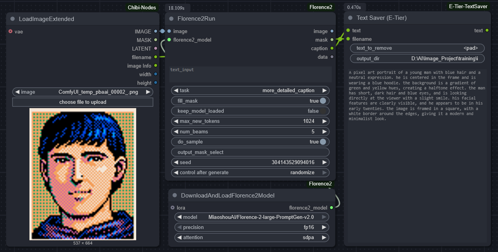

📦 **ComfyUI-E-Tier-TextSaver**

A secure and flexible text-saving node for ComfyUI — optimized for LoRA dataset workflows.  
Supports safe `.txt` export after captioning nodes such as Florence2.

---

✨ **Key Features**

- ✅ Save caption text to custom paths  
- 🔐 Strict security validation to prevent unsafe writes  
- 🧩 Works seamlessly with Florence/BLIP caption nodes  
- 📂 Supports LoRA dataset directory workflows  

---

🧑‍💻 **Use Case Example**

In LoRA training workflows, users often need to save `.txt` captions beside their training images.

Typical flow:

```
[Image Loader] ➡️ [Captioning Node] ➡️ [Text Saver (E-Tier)]
```



---

🔐 **Security Measures**

To ensure safe file operations, all output paths are strictly validated:

| ✅ Allowed                  | ❌ Blocked                                      |
|----------------------------|-------------------------------------------------|
| Existing directories only  | Nonexistent paths (no auto-creation)            |
| Absolute paths             | Relative traversal (e.g., `../`)                |
| Safe characters            | Shell/metacharacters (e.g., `|`, `;`, `$`, etc.)|
| Normal text input          | Malicious code (e.g., `eval`, `<script>`)       |

📌 The final save path is printed clearly in the console for transparency.

---

⚙️ **Node Parameters**

| Parameter    | Description                                   |
|--------------|-----------------------------------------------|
| `text`       | The text to be saved                          |
| `filename`   | Optional custom file name                     |
| `output_dir` | Must be an existing, validated output directory |

---

❗ **Notes**

- If validation fails, a clear error will be shown.  
- The node does not create directories — please prepare your dataset structure in advance.  
- Designed with security in mind: safe by default, flexible by configuration.  

---

🛠️ **Installation**

```bash
git clone https://github.com/e-tier-newbie/ComfyUI-E-Tier-TextSaver
```

Place the folder under `ComfyUI/custom_nodes/`, then restart ComfyUI.

---

🙏 **Credits**

E-tier-newbie  
NDY
