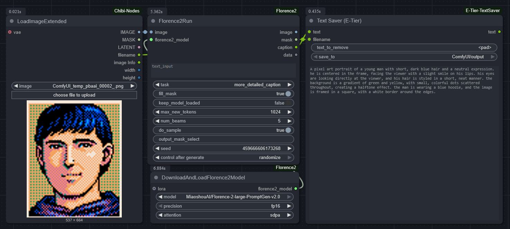

# 📦 ComfyUI-E-Tier-TextSaver

Sick of annoying <pad> tokens messing up your prompts? 😂 This one’s for you.

A secure and flexible text-saving node for ComfyUI.  
After captioning with Florence2 or similar, it automatically strips unwanted tokens and saves a clean `.txt` file.

---

✨ **Key Features**

- ✅ Removes unwanted tokens like `<pad>` from caption text  
- 🔐 Strict path validation and filename sanitization  
- 🧩 Works smoothly with Florence/BLIP captioning nodes  
- 📂 Supports LoRA-style image-text dataset workflows  

---

🧑‍💻 **Use Case Example**

When training LoRA models, it's common to need `.txt` caption files that match image filenames.  
This node makes that easy by fitting naturally into a workflow like this:

```
[Image Loader] ➡️ [Captioning Node] ➡️ [Text Saver (E-Tier)]
```



---

🔐 **Security Design**

All save paths go through strict validation checks:

| ✅ Allowed                     | ❌ Blocked                                              |
|-------------------------------|----------------------------------------------------------|
| Existing directories only      | Non-existent paths (no auto-creation)                  |
| Absolute paths                 | Relative traversal (e.g., `../`)                        |
| Safe characters                | Shell/metacharacters (e.g., `|`, `;`, `$`, etc.)        |
| Clean text input               | Suspicious patterns (e.g., `eval`, `<script>`, etc.)    |

📌 The final save path is clearly printed to the console for full transparency.

---

⚙️ **Node Parameters**

| Parameter   | Description                                        |
|-------------|----------------------------------------------------|
| `text`      | The text content to be saved (required)            |
| `filename`  | Filename for the resulting `.txt` file (required)  |
| `save_to`   | Output directory selected from a dropdown list      |

---

### About the `save_to` Parameter

The save_to dropdown paths are specified in the node's YAML whitelist file.
Users can set custom keys (names) and their corresponding directory paths in the YAML whitelist like this:

```yaml
whitelist:
  ComfyUI/output: "./ComfyUI/output"
  CustomFolder: "./my_custom_output"
```

Here, `"CustomFolder"` is the label shown in the dropdown, and `"./my_custom_output"` is the actual directory path used for saving files.  
This allows flexible and user-friendly naming of output locations.

---

❗ **Other Notes**

- Any validation errors will be clearly displayed in the console or UI.  
- If no filename is given, it defaults to `"untitled.txt"`.  
- This node will not create directories — make sure your structure exists.  
- Secure by default, but configurable for advanced users.

---

🛠️ **Installation**

```bash
git clone https://github.com/e-tier-newbie/ComfyUI-E-Tier-TextSaver
```

Place the folder under `ComfyUI/custom_nodes/` and restart ComfyUI.

---

🙏 **Credits**

E-tier-newbie  
NDY
